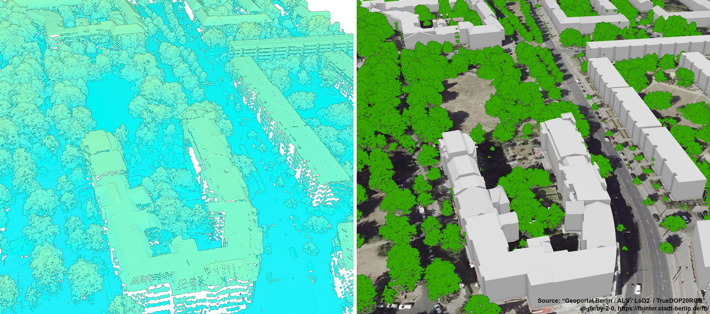
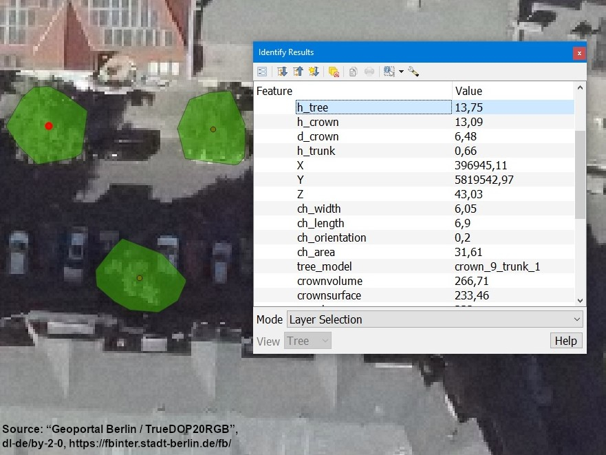
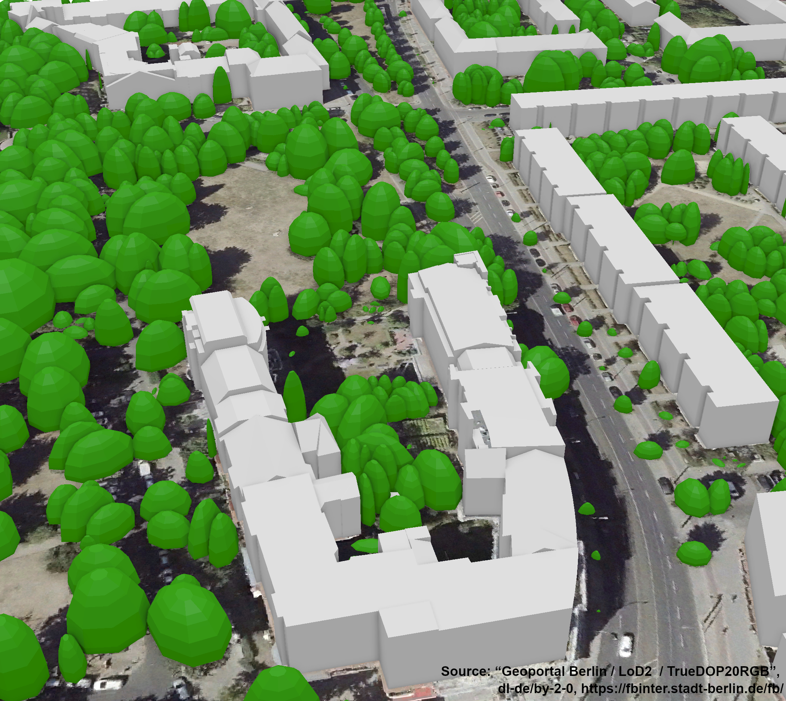

# LiDAR-3D-Urban-Forest-Mapping

## Overview
This repository contains scripts for high-resolution area-wide mapping and 3D modeling of urban forests based on LiDAR point clouds. 
The workflow is designed for widely available LiDAR point clouds with a density of at least 4 pts/m² and has been published in this [research article](https://doi.org/10.1016/j.ufug.2022.127637).

Processing steps: 

* Classification of the urban forest in an object-based data fusion approach combining the point cloud with multispectral aerial imagery and a 3D building model
* Detection, segmentation and parameterization of individual tree crowns 
* Efficient reconstruction and 3D modeling of tree crowns using geometric primitives

Data generated with the workflow for an entire city can be downloaded for Dresden (Germany) at the following links.

* [Canopy Height Model](https://zenodo.org/record/7536524)
* [Parameterized Tree Positions](https://zenodo.org/record/7536550)
* [Semantic 3D Tree Model](https://zenodo.org/record/7536562)

## Software 
The algorithms for the urban forest classification up to the parameterization of individual tree crowns are implemented as [ready-to-use workflow](/src/R/workflow_markdown.Rmd) in *R*.  
Solely for the last step, the 3D modeling of the trees in the CityGML schema, the proprietary software *FME* from *Safe Software* is used. The [FME Workbench](/src/fme_workbench/Create_3D_Tree_Models_geojson2citygml.fmw) created to generate the semantic 3D tree models as well as [prototypic 3D tree models](/data/tree_prototypes) are available in this repository.  
Gridded building roof heights can be used as supplementary data for the identification of roof points. A *PostgreSQL* script to [rasterize roofs heights](/src/postgresql/3DCityDB_rasterize_lod2_roof_heights.pgsql) for 3D city models stored in a [3D City Database](https://www.3dcitydb.org/3dcitydb/) is included in the repository.

## Key features
### Urban forest classification

The classified point cloud and a canopy height model are generated as output.

### Individual crown parameterization

Tree positions as point features and crown segments as polygon features are generated as output.

### 3D tree modeling

Tree Models as CityGML Solitary Vegetation Objects are generated as output.

## Input data
The repository contains test data for a small area of Berlin (Germany). 

The raw data used was made freely available by the [“Geoportal Berlin”](https://fbinter.stadt-berlin.de/fb/index.jsp) under the license ["Data license Germany - attribution - Version 2.0"](https://www.govdata.de/dl-de/by-2-0) and can be downloaded at the following links:

* [LiDAR](https://fbinter.stadt-berlin.de/fb/feed/senstadt/a_als)
* [3D Building Model](https://fbinter.stadt-berlin.de/fb/feed/senstadt/a_lod2)
* [Aerial Imagery](https://fbinter.stadt-berlin.de/fb/feed/senstadt/a_luftbild2020_true_cir)

In addition to the LiDAR point cloud, the NDVI as multispectral index and roof heights derived from a 3D building model are used for the urban forest classification.   
Both data sets were prepared from raw data. While calculating the NDVI from multispectral imagery can be done in most GIS environments, GIS ususally have limitations when dealing with 3D city models.  
Therefore, a PostgreSQL script to  [rasterize building roof heights](/src/postgresql/3DCityDB_rasterize_lod2_roof_heights.pgsql) from 3D building models stored in a 3D City Database is also available in this repository.  
The 3D City Database is an Open Source spatial relational database schema to store, represent, and manage semantic 3D city models in the CityGML schema.

